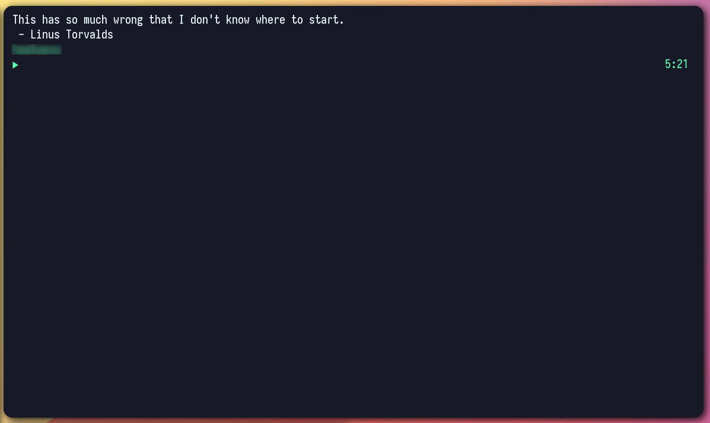

# Nothing motivates me more than Linus calling my code shit and braindamaged 🌟



## Put me on!
✅ Install latest release and save(~/.local/bin)

✅ Make executable(chmod +x ~/.local/bin/linusRantinator)

✅ Add to init script
```(bash)
~/.local/bin/linusRantinator
```

✅ 💲💲

## Roadmap

- [ ] Release v1

- [ ] Optimize data fetching

### Dataset taken with love from [linusrants](https://github.com/corollari/linusrants)